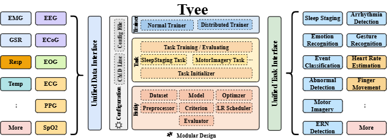
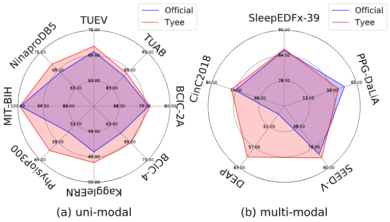

<div align="center">

# Tyee

<!-- Language Switch with Badges -->
<p>
  <a href="./README.md">
    
  </a>
  <a href="./README_Chinese.md">
    
  </a>
  <a href="https://creativecommons.org/licenses/by-nc/4.0/">
    
  </a>
</p>

</div>

## 简介

Tyee 是一款基于 PyTorch 的生理信号智能分析工具。它旨在赋能研究人员与开发者，针对多源异构生理信号进行高效的任务分析，并致力于简化从数据预处理到模型训练与评估的全流程，提供一体化的解决方案。

<div align="center">



</div>

*Tyee核心特性概览——展示了其对EEG、ECG、EMG等多种生理信号的统一接口支持，针对睡眠分期、情绪识别等多样化任务的灵活适配能力，以及模块化设计和端到端集成处理流程。*

## ✨功能特性

Tyee 具备以下核心特性：

- **统一的数据接口与可配置预处理流程 (Unified Data Interface & Configurable Preprocessing)**：针对多样化的信号模态（例如EEG、ECG、EMG等）提供统一的数据接口和灵活配置的预处理流水线。 
- **模块化与可扩展架构 (Modular and Extensible Architecture)**：采用模块化设计，易于在不同任务间灵活集成组件和快速原型验证。 
- **全流程集成支持 (Fully-Integrated Support)**：提供从预处理到训练的全面集成支持，促进可复现和可扩展的实验。 
- **广泛的信号与任务覆盖**：如上图所示，框架设计使其能轻松应用于多种生理信号及分析任务。 
- **基于PyTorch构建 (Built with PyTorch)**：充分利用PyTorch的灵活性和强大的生态系统进行高效的模型开发与训练。

## 🛠️框架模块

Tyee 的核心架构采用模块化设计（如下图所示），确保各组件高度独立且易于扩展，实现了即插即用的灵活性。

<div align="center">


</div>

*Tyee 模块结构图，展示了配置、训练器、任务、实体（数据、模型、预处理器等）等核心组件及其交互关系。*

下表详细介绍了 Tyee 框架的主要模块及其功能。每个模块名均链接至其专属的 README 文档，方便您深入了解具体实现与使用方法。

| 模块名                  | 描述                                                         |
| ----------------------- | ------------------------------------------------------------ |
| [Tyee.dataset](./docs/module/dataset_Chinese.md)            | 提供了统一且灵活的数据接口处理异构数据                       |
| [Tyee.dataset.io](./docs/module/dataset_io_Chinese.md)         | 实现了一套统一的输入输出IO来存储各种异构数据集的处理结果     |
| [Tyee.dataset.transform](./docs/module/transform_Chinese.md)  | 提供丰富的预处理方法可供用户灵活选择                         |
| [Tyee.dataset.split](./docs/module/split_Chinese.md)      | 提供丰富的数据划分方法供用户选择实现不同粒度的设置           |
| [Tyee.model](./docs/module/model_Chinese.md)              | 提供常用的任务分析模型，可供用户复现                         |
| [Tyee.criterion](./docs/module/criterion_Chinese.md)          | 在Pytorch的基础上损失函数上进行了扩展                        |
| [Tyee.metrics](./docs/module/metrics_Chinese.md)            | 提供丰富的分类和回归评估指标                                 |
| Tyee.optim              | 使用Pytorch的优化器                                          |
| [Tyee.optim.lr_scheduler](./docs/module/lr_scheduler_Chinese.md) | 重新封装了Pytorch的学习率调度器，并进行了扩展                |
| [Tyee.task](./docs/module/task_Chinese.md)               | 负责初始化实体层的所有组件，并定义任务从前向传播到损失计算的训练逻辑 |
| [Tyee.trainer](./docs/module/trainer_Chinese.md)            | 负责端到端的训练和验证过程                                   |
| [Tyee.config](./docs/module/config_Chinese.md)             | 通过YAML文件提供对全框架的集中控制                           |

## 🚀 安装指南

**环境要求**: 

- Python 3.10 
- PyTorch 2.5.0 

### 方法1：使用 Conda

**克隆代码仓库**: 

```bash
$ git clone https://github.com/SmileHnu/Tyee.git
$ cd Tyee
```

**创建并激活虚拟环境**:

```bash
$ conda env create -n tyee -f environment.yml
$ conda activate tyee
```

### 方法2：使用 Docker

**克隆代码仓库**: 

```bash
$ git clone https://github.com/SmileHnu/Tyee.git
$ cd Tyee
```

**构建并运行 Docker 容器**:

```bash
# 构建Docker镜像
$ docker build -t tyee:latest .

# 运行容器
$ docker run -it --name tyee-dev \
  -v $(pwd)/tyee:/tyee/tyee \
  -p 6006:6006 \
  tyee:latest bash
```

## 📊 支持的数据集和模型

我们在Tyee框架上支持了一些数据集，方便用户进行使用和扩展。下表汇总了已支持的数据集及其涉及的信号和任务：

| 数据集                                                       | 信号类型                            | 任务                 |
| ------------------------------------------------------------ | ----------------------------------- | -------------------- |
| [TUEV](https://isip.piconepress.com/projects/nedc/html/tuh_eeg/#c_tuev) | EEG                                 | Event Classification |
| [TUAB](https://isip.piconepress.com/projects/nedc/html/tuh_eeg/#c_tuab) | EEG                                 | Abnormal Detection   |
| [BCICIV-2A](https://www.bbci.de/competition/iv/#datasets)    | EEG, EOG                            | Motor Imagery        |
| [BCICIV-4](https://www.bbci.de/competition/iv/#datasets)     | ECoG                                | Finger Movement      |
| [KaggleERN](https://www.kaggle.com/c/inria-bci-challenge/data) | EEG                                 | ERN Detection        |
| [PhysioP300](https://physionet.org/content/erpbci/1.0.0/)    | EEG                                 | P300 Recognition     |
| [MIT-BIH](https://physionet.org/content/mitdb/1.0.0/)        | ECG                                 | Arrhythmia Detection |
| [NinaproDB5](https://ninapro.hevs.ch/instructions/DB5.html)  | EMG                                 | Gesture Recogntion   |
| [PPG-DaLiA](https://archive.ics.uci.edu/dataset/495/ppg+dalia) | PPG, 3D Acc, HR                     | HR Estimation        |
| [SEED-V](https://bcmi.sjtu.edu.cn/home/seed/seed-v.html)     | EEG, EOG                            | Emotion Recognition  |
| [DEAP](http://eecs.qmul.ac.uk/mmv/datasets/deap/)            | EEG, EOG, EMG, GSR, RESP, PPG, TEMP | Emotion Recognition  |
| [SleepEDFx](https://physionet.org/content/sleep-edfx/1.0.0/) | EEG, EOG, EMG, RESP, TEMP           | Sleep Staging        |
| [CinC2018](https://physionet.org/content/challenge-2018/1.0.0/) | EEG, EOG, EMG, RESP, SpO2,ECG       | Sleep Staging        |

Tyee框架集成了一系列常用的生理信号分析模型，同时也支持用户自定义和扩展模型。下表汇总了已支持的模型及其对应的参考文献，方便用户查阅和使用：

| 模型                                                         | 论文                                                         |
| ------------------------------------------------------------ | ------------------------------------------------------------ |
| [LaBraM](https://github.com/935963004/LaBraM)                | [Large Brain Model for Learning Generic Representations with Tremendous EEG Data in BCI](https://openreview.net/forum?id=QzTpTRVtrP) |
| [EEGPT](https://github.com/BINE022/EEGPT)                    | [EEGPT: Pretrained Transformer for Universal and Reliable Representation of EEG Signals](https://proceedings.neurips.cc/paper_files/paper/2024/hash/4540d267eeec4e5dbd9dae9448f0b739-Abstract-Conference.html) |
| [BIOT](https://github.com/ycq091044/BIOT)                    | [BIOT: Cross-data Biosignal Learning in the Wild](https://proceedings.neurips.cc/paper_files/paper/2023/hash/f6b30f3e2dd9cb53bbf2024402d02295-Abstract-Conference.html) |
| [EEGConformer](https://github.com/eeyhsong/EEG-Conformer)    | [EEG Conformer: Convolutional Transformer for EEG Decoding and Visualization](https://ieeexplore.ieee.org/abstract/document/9991178/) |
| [FingerFlex](https://github.com/Irautak/FingerFlex)          | [FingerFlex: Inferring Finger Trajectories from ECoG signals](https://arxiv.org/abs/2211.01960) |
| [ECGResNet34](https://github.com/lxdv/ecg-classification)    | [Diagnosis of Diseases by ECG Using Convolutional Neural Networks](https://www.hse.ru/en/edu/vkr/368722189) |
| [EMGBech-ResNet18](https://github.com/jehanyang/emgbench)    | [EMGBench: Benchmarking Out-of-Distribution Generalization and Adaptation for Electromyography](https://proceedings.neurips.cc/paper_files/paper/2024/hash/59fe60482e2e5faf557c37d121994663-Abstract-Datasets_and_Benchmarks_Track.html) |
| [G2G-ResNet18](https://github.com/Jinminbox/G2G)             | [Graph to Grid: Learning Deep Representations for Multimodal Emotion Recognition](https://dl.acm.org/doi/abs/10.1145/3581783.3612074) |
| [BeliefPPG](https://github.com/eth-siplab/BeliefPPG)         | [BeliefPPG: Uncertainty-aware Heart Rate Estimation from PPG signals via Belief Propagation](https://proceedings.mlr.press/v216/bieri23a.html) |
| [MLSTM-FCN](https://github.com/titu1994/MLSTM-FCN)           | [Multivariate LSTM-FCNs for time series classification](https://www.sciencedirect.com/science/article/abs/pii/S0893608019301200) |
| [SalientSleepNet](https://github.com/ziyujia/SalientSleepNet) | [SalientSleepNet: Multimodal Salient Wave Detection Network for Sleep Staging](https://arxiv.org/abs/2105.13864) |
| [SleepFM](https://github.com/rthapa84/sleepfm-codebase)      | [SleepFM: Multi-modal Representation Learning for Sleep Across Brain Activity,ECG and Respiratory Signals](https://arxiv.org/abs/2405.17766) |

## 🧪性能基准和应用示例

为充分验证 Tyee 框架的性能与泛化能力，我们在13个公开生理信号数据集上进行了广泛的实验。以下展示了主要的实验结果与详细配置，这些示例亦可作为您使用本框架的快速入门参考。

<div align="center">



</div>

下表汇总了本次基准测试所涵盖的13个数据集、对应的信号类型、分析任务及所采用的模型。每个条目均提供了指向详细实验配置（README）和相关模型官方仓库链接，方便用户复现与深入研究。

| 数据集                                                       | 信号类型                 | 任务                 | 模型                                                         | 详细实验链接 |
| ------------------------------------------------------------ | ------------------------ | -------------------- | ------------------------------------------------------------ | ------------ |
| [TUEV](https://isip.piconepress.com/projects/nedc/html/tuh_eeg/#c_tuev) | EEG                      | Event Classification | [LaBraM](https://github.com/935963004/LaBraM)                | [实验详情](./docs/experiments/TUEV_Chinese.md)     |
| [TUAB](https://isip.piconepress.com/projects/nedc/html/tuh_eeg/#c_tuab) | EEG                      | Abnormal Detection   | [LaBraM](https://github.com/935963004/LaBraM)                | [实验详情](./docs/experiments/TUAB_Chinese.md)     |
| [BCICIV-2A](https://www.bbci.de/competition/iv/#datasets)    | EEG                      | Motor Imagery        | [EEGConformer](https://github.com/eeyhsong/EEG-Conformer)    | [实验详情](./docs/experiments/BCICIV2A_Chinese.md)    |
| [BCICIV-4](https://www.bbci.de/competition/iv/#datasets)     | ECoG                     | Finger Movement      | [FingerFlex](https://github.com/Irautak/FingerFlex)          | [实验详情](./docs/experiments/BCICIV4_Chinese.md)    |
| [KaggleERN](https://www.kaggle.com/c/inria-bci-challenge/data) | EEG                      | ERN Detection        | [EEGPT](https://github.com/BINE022/EEGPT)                    | [实验详情](./docs/experiments/KaggleERN_Chinese.md)     |
| [PhysioP300](https://physionet.org/content/erpbci/1.0.0/)    | EEG                      | P300 Recognition     | [EEGPT](https://github.com/BINE022/EEGPT)                    | [实验详情](./docs/experiments/PhysioP300_Chinese.md)     |
| [MIT-BIH](https://physionet.org/content/mitdb/1.0.0/)        | ECG                      | Arrhythmia Detection | [ECGResNet34](https://github.com/lxdv/ecg-classification)    | [实验详情](./docs/experiments/MITBIH_Chinese.md)     |
| [NinaproDB5](https://ninapro.hevs.ch/instructions/DB5.html)  | EMG                      | Gesture Recogntion   | [EMGBench-ResNet18](https://github.com/jehanyang/emgbench)   | [实验详情](./docs/experiments/NinaproDB5_Chinese.md)     |
| [PPG-DaLiA](https://archive.ics.uci.edu/dataset/495/ppg+dalia) | PPG, 3D Acc, HR          | HR Estimation        | [BeliefPPG](https://github.com/eth-siplab/BeliefPPG)         | [实验详情](./docs/experiments/DaLiA_Chinese.md)     |
| [SEED-V](https://bcmi.sjtu.edu.cn/home/seed/seed-v.html)     | EEG, EOG                 | Emotion Recognition  | [G2G-ResNet18](https://github.com/Jinminbox/G2G)             | [实验详情](./docs/experiments/SEEDV_Chinese.md)     |
| [DEAP](http://eecs.qmul.ac.uk/mmv/datasets/deap/)            | GSR, RESP, PPG, TEMP     | Emotion Recognition  | [MLSTM-FCN](https://github.com/athar70/MLSTM)                | [实验详情](./docs/experiments/DEAP_Chinese.md)     |
| [SleepEDFx](https://physionet.org/content/sleep-edfx/1.0.0/) | EEG, EOG                 | Sleep Staging        | [SalientSleepNet](https://github.com/ziyujia/SalientSleepNet) | [实验详情](./docs/experiments/SleepEDFx_Chinese.md)     |
| [CinC2018](https://physionet.org/content/challenge-2018/1.0.0/) | EEG, EOG, RESP, SpO2,ECG | Sleep Staging        | [SleepFM](https://github.com/rthapa84/sleepfm-codebase)      | [实验详情](./docs/experiments/CinC2018_Chinese.md)     |

## 🤝 贡献

我们欢迎任何形式的贡献，包括但不限于：

- 报告Bug
- 提交功能请求
- 代码贡献
- 文档改进

## 🙏 参考与致谢

Tyee 的设计与实现借鉴了以下优秀的开源项目，并从中获益良多，在此表示衷心的感谢：

* [PyTorch](https://github.com/pytorch/pytorch) 
*  [mne](https://github.com/mne-tools/mne-python) 
*  [s3prl](https://github.com/s3prl/s3prl)
* [fairseq](https://github.com/facebookresearch/fairseq) 
*  [torcheeg](https://github.com/torcheeg/torcheeg)

### 资助致谢

本工作得到以下基金项目的支持：
- 广东省基础与应用基础研究基金（项目编号：2024A1515010112）
- 长沙市科技局基金（项目编号：kq2402082）

## 📝 许可证

[![CC BY-NC 4.0][cc-by-nc-shield]][cc-by-nc]

本作品采用
[知识共享署名-非商业性使用 4.0 国际许可协议][cc-by-nc] 进行许可。

[![CC BY-NC 4.0][cc-by-nc-image]][cc-by-nc]

详细许可证条款请参阅 [`LICENSE`](./LICENSE) 文件。

[cc-by-nc]: https://creativecommons.org/licenses/by-nc/4.0/
[cc-by-nc-image]: https://licensebuttons.net/l/by-nc/4.0/88x31.png
[cc-by-nc-shield]: https://img.shields.io/badge/License-CC%20BY--NC%204.0-lightgrey.svg

## 📖引用

